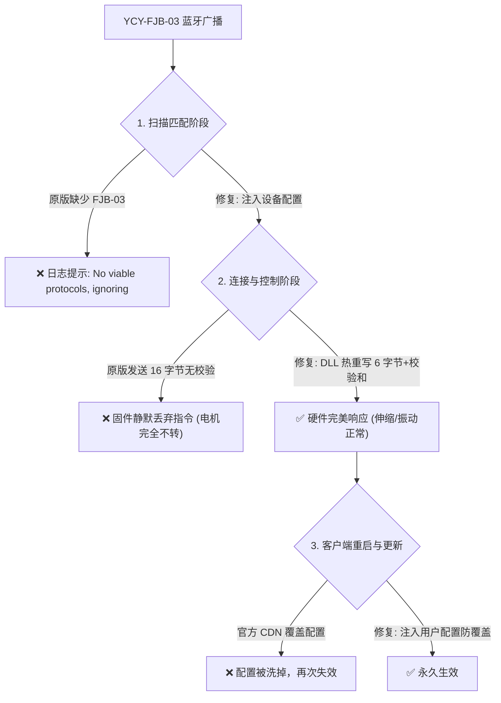

# Intiface Central Yiciyuan YCY-FJB-03 Fix

<p align="center">
  
  
  
  
</p>

[**中文说明**](#中文说明) | [**English**](#english)

---

## 中文说明

本项目为**役次元 (Yiciyuan) 电动飞机杯三代 (型号: YCY-FJB-03)** 在 **Intiface Central** (Buttplug.io) 上的全自动适配与修复工具。
*电动飞机杯二代已被官方支持 (型号: YCY-FJB-01)
### 痛点与根本原因分析

在使用官方 Intiface Central 连接 YCY-FJB-03 时，会遇到以下三个关键问题：



1. **扫描识别被过滤**：官方设备库仅配置了 `YCY-FJB-01` 与 `YCY-FJB-02`，未收录 `YCY-FJB-03`，导致客户端扫描到蓝牙但直接忽略。
2. **云端覆盖失效**：Intiface Central 每次启动都会从官方 CDN 静默下载最新配置，覆盖本地手动修改。
3. **固件通讯协议不匹配（核心硬件无反应原因）**：
   - Buttplug 原生 Rust 库 (`rust_lib_intiface_central.dll`) 的 `yiciyuan` 驱动默认构造 16 字节缓冲区：`[0x35, 0x12, stroke, vibe, axis_c, 0, 0, ...]`，**没有累加校验和**。
   - YCY-FJB-03 固件严格要求 **6 字节帧**：
     $$\text{Packet} = [0\text{x}35,\; 0\text{x}12,\; \text{stroke},\; \text{vibe},\; \text{axis\_c},\; \text{checksum}]$$
     其中校验和算法为：
     $$\text{checksum} = (0\text{x}35 + 0\text{x}12 + \text{stroke} + \text{vibe} + \text{axis\_c}) \pmod{256}$$
   - 数据包长度不为 6 或校验和错误时，固件会静默丢弃，导致连接成功但滑块调节毫无反应。

### 解决方案

本工具提供一体化解决方案：
1. **自动热修补 DLL**：精确重写 `rust_lib_intiface_central.dll` 中的 45 字节机器码，将内存分配由 16 改为 6，并在汇编层实时计算 8 位累加校验和；
2. **双层配置注入**：同时修改主配置文件与用户配置文件 (`buttplug-user-device-config-v5.json`)，避免官方自动更新再次覆盖；
3. **一键执行**：双击即可全自动检测路径、备份原文件、打上补丁并重启服务。

---

### 快速开始

#### 前置要求
* 操作系统：Windows 10 / 11
* 已安装 [Node.js](https://nodejs.org)（用于执行 DLL 二进制热补丁）
* 已安装 [Intiface Central](https://intiface.com/central/)

#### 使用步骤

1. 下载或克隆本项目：
   ```powershell
   git clone https://github.com/DDeeply/intiface-ycy-fjb03-fix.git
   ```
2. 双击运行 **`run_fix.bat`**（或右键运行 `Fix-YCY-FJB03.ps1`）；
3. 脚本会自动完成备份与修补：
   ```text
   === STEP 1: Main Device Config (buttplug-device-config-v5.json) ===
     [OK] Added YCY-FJB-03 to BLE advertisement filter.
   === STEP 2: User Device Config (Anti-Overwrite Protection) ===
     [OK] User configuration protected.
   === STEP 3: Engine DLL Binary Patch ===
     [OK] DLL hot-patch applied successfully!
   === STEP 4: Service Reload / Restart ===
     [OK] Intiface Central restarted successfully.
   ```
4. 打开 Intiface Central：
   - 点击 **Start Server**；
   - 打开飞机杯电源，进入蓝牙配对模式；
   - 点击 **Start Scanning**，即可直接识别并连接；
   - 支持通过 ScriptPlayer、各类体感游戏、网页工具（如 ASMR-One 等）原生驱动控制。

---

## English

Automated fix and hardware compatibility patch for **Yiciyuan (役次元) YCY-FJB-03 Electric Masturbator** on **Intiface Central** (Buttplug.io).

### Technical Background

When connecting `YCY-FJB-03` with vanilla Intiface Central:
1. **Device Ignored**: The official device specifiers only recognized `YCY-FJB-01` and `YCY-FJB-02`.
2. **Silent Packet Drop**:
   - Buttplug's Rust protocol implementation allocated a 16-byte buffer `[0x35, 0x12, stroke, vibe, axis_c, 0, ...]` with **no checksum**.
   - `YCY-FJB-03` firmware strictly expects a **6-byte frame**:
     `[0x35, 0x12, stroke (0-20), vibe (0-20), axis_c (0-20), checksum]`,
     where `checksum = (0x35 + 0x12 + stroke + vibe + axis_c) & 0xFF`.
   - Any frame not exactly 6 bytes or with an invalid checksum is silently dropped by the toy.
3. **Auto-Update Regression**: Intiface Central pulls down remote configuration files on every start, wiping local edits to `buttplug-device-config-v5.json`.

### Features

- **Binary Hot-patch**: Automatically replaces 45 bytes of machine code in `rust_lib_intiface_central.dll` to allocate 6 bytes, compute the 8-bit checksum in assembly, and update vector length & capacity.
- **Persistent User Configuration**: Injects protocol overrides into `buttplug-user-device-config-v5.json`, preserving device support across Intiface Central cloud updates.
- **Zero-touch Automation**: One click (`run_fix.bat`) to detect, patch, backup, and reload.

---

### Project Structure

```text
├── Fix-YCY-FJB03.ps1      # Main PowerShell automated fix script
├── ycy_dll_patch.js       # Node.js binary patcher for rust_lib_intiface_central.dll
├── run_fix.bat            # Double-click launcher
├── README.md              # Documentation
├── LICENSE                # MIT License
└── .gitignore             # Git ignore rules
```

---

### License

This project is licensed under the [MIT License](LICENSE).
