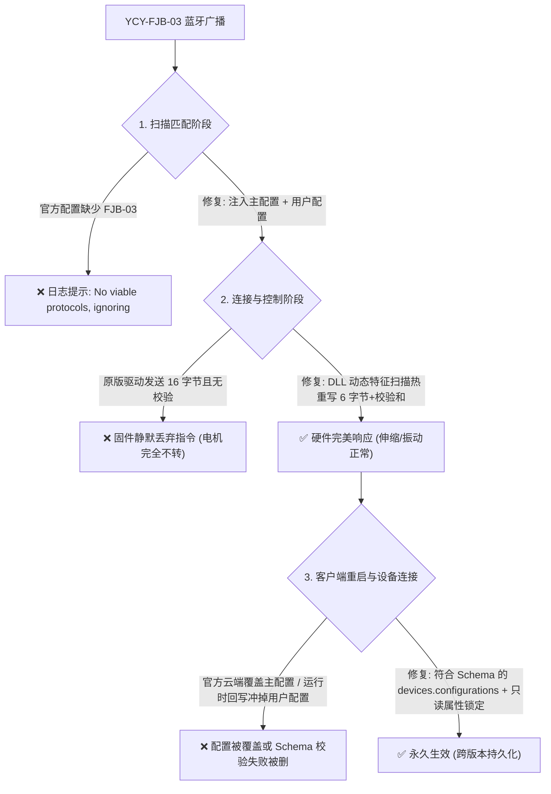

# Intiface Central Yiciyuan YCY-FJB-03 Fix

<p align="center">
  
  
  
  
  
</p>

[**中文说明**](#中文说明) | [**English**](#english)

---

## 中文说明

本项目为**役次元 (Yiciyuan) 电动飞机杯三代 (型号: YCY-FJB-03)** 在 **Intiface Central** (Buttplug.io) 上的全自动适配与修复工具。
*电动飞机杯二代已被官方支持 (型号: YCY-FJB-01)
### 痛点与根本原因分析

在使用官方原版 Intiface Central 连接 YCY-FJB-03 时，会遇到以下核心问题：



1. **扫描识别被过滤**：官方设备库仅配置了 `YCY-FJB-01` 与 `YCY-FJB-02`，未收录 `YCY-FJB-03`，导致客户端扫描到蓝牙但直接忽略。
2. **云端覆盖与运行时回写擦除**：
   - Intiface Central 每次启动都会从官方 CDN 静默同步最新配置，覆盖本地修改；
   - 用户配置如果不符合内嵌 draft-07 Schema（要求写在 `devices.configurations` 而非外层），会被 Intiface 判定非法并在启动时强行删除；
   - 此外，设备连接时 Buttplug 会向磁盘序列化配置，清空 `protocols`。本工具通过合规的 Schema 注入结合**只读锁（Read-Only Lock）**，彻底阻断运行时的意外擦除。
3. **固件通讯协议不匹配（核心硬件无反应原因）**：
   - Buttplug 原生 Rust 库 (`rust_lib_intiface_central.dll`) 的 `yiciyuan` 驱动默认构造 16 字节缓冲区：`[0x35, 0x12, stroke, vibe, axis_c, 0, 0, ...]`，**没有累加校验和**。
   - YCY-FJB-03 固件严格要求 **6 字节帧**：
     $$\text{Packet} = [0\text{x}35,\; 0\text{x}12,\; \text{stroke},\; \text{vibe},\; \text{axis\_c},\; \text{checksum}]$$
     其中校验和算法为：
     $$\text{checksum} = (0\text{x}35 + 0\text{x}12 + \text{stroke} + \text{vibe} + \text{axis\_c}) \pmod{256}$$
   - 数据包长度不为 6 或校验和错误时，固件会静默丢弃，导致连接成功但滑块调节毫无反应。

---

### v1.1.0 重大更新

- **动态特征码扫描**：告别硬编码偏移量。工具自动全文件检索 45 字节机器码特征，自适应兼容各版本 Intiface Central（包括 `3.2.1+45` 及后续更新版本）。
- **Schema 结构完全合规**：修正用户配置层级为 `user_configs.protocols.yiciyuan.devices.configurations`，清洗非法 `null` 记录，彻底根治 `Error loading cubit! Deleting configs` 报错。
- **只读锁定持久化保护**：自动将用户配置文件设为只读，阻断 Buttplug 运行时序列化清空协议的 Bug。
- **无 BOM UTF-8**：解决 Windows PowerShell 5.1 默认输出 UTF-8 BOM 导致严格 JSON 解析器报错的问题。
- **路径自适应扩展**：全面支持 C/D/E/F 盘 `Program Files` 及 `Program Files (x86)` 常见安装路径。

---

### 快速开始

#### 前置要求
* 操作系统：Windows 10 / 11 (x64)
* 已安装 [Node.js](https://nodejs.org)（用于执行 DLL 动态特征补丁）
* 已安装 [Intiface Central](https://intiface.com/central/)

#### 使用步骤

1. 下载或克隆本项目：
   ```powershell
   git clone https://github.com/DDeeply/intiface-ycy-fjb03-fix.git
   ```
2. 双击运行 **`run_fix.bat`**（或右键管理员运行 `Fix-YCY-FJB03.ps1`）；
3. 脚本会自动完成备份与修补：
   ```text
   ========================================================
     Yiciyuan YCY-FJB-03 Intiface Central Fix (v1.1.0)     
   ========================================================
   === STEP 1: Main Device Config (buttplug-device-config-v5.json) ===
     [OK] Added YCY-FJB-03 to BLE advertisement filter.
   === STEP 2: User Device Config (Schema-Compliant & Read-Only Lock) ===
     [OK] User configuration injected & locked as READ-ONLY.
   === STEP 3: Engine DLL Binary Patch (Dynamic Signature Scan) ===
     [OK] DLL hot-patch applied successfully!
   === STEP 4: Service Reload / Restart ===
     [OK] Intiface Central restarted successfully.
   ```
4. 打开 Intiface Central：
   - 点击 **Start Server**；
   - 打开飞机杯电源，进入蓝牙配对模式；
   - 点击 **Start Scanning**，即可直接识别并连接；
   - 支持通过 ScriptPlayer、各类体感游戏、网页工具（如 ASMR-One 等）原生驱动控制。

---

## English

Automated fix and hardware compatibility patch for **Yiciyuan (役次元) gen3 YCY-FJB-03 Electric Masturbator** on **Intiface Central** (Buttplug.io).
*Yiciyuan (役次元) gen1 YCY-FJB-01 Electric Masturbator was supported offically.
### Technical Background

When connecting `YCY-FJB-03` with vanilla Intiface Central:
1. **Device Ignored**: The official device specifiers only recognized `YCY-FJB-01` and `YCY-FJB-02`.
2. **Silent Packet Drop**:
   - Buttplug's Rust protocol implementation allocated a 16-byte buffer `[0x35, 0x12, stroke, vibe, axis_c, 0, ...]` with **no checksum**.
   - `YCY-FJB-03` firmware strictly expects a **6-byte frame**:
     `[0x35, 0x12, stroke (0-20), vibe (0-20), axis_c (0-20), checksum]`,
     where `checksum = (0x35 + 0x12 + stroke + vibe + axis_c) & 0xFF`.
   - Any frame not exactly 6 bytes or with an invalid checksum is silently dropped by the toy.
3. **Auto-Update & Runtime Serialization Issues**:
   - Intiface Central pulls down remote configuration files on every start, wiping local edits to `buttplug-device-config-v5.json`.
   - User configuration must strictly adhere to the internal draft-07 Schema (`devices.configurations`), otherwise Intiface deletes it on startup (`Error loading cubit! Deleting configs`).
   - Buttplug rewrites user configs upon device connection, clearing protocol overrides. We lock the user config as read-only to guarantee permanent persistence.

### What's New in v1.1.0

- **Dynamic Signature Scanning**: Replaced hardcoded binary offsets with 45-byte pattern matching. Works out-of-the-box across versions (e.g. 3.2.1+45 and future builds).
- **Strict Schema Compliance**: Restructured user config to `user_configs.protocols.yiciyuan.devices.configurations` and sanitized null identifiers.
- **Read-Only Persistence Lock**: Protects user configs from runtime wiping.
- **UTF-8 No-BOM Output**: Prevents BOM parsing errors on PowerShell 5.1.
- **Expanded Path Auto-Discovery**: Supports x86 and multi-drive installations.

---

### Project Structure

```text
├── Fix-YCY-FJB03.ps1      # Main PowerShell automated fix script (v1.1.0)
├── ycy_dll_patch.js       # Node.js dynamic signature patcher for rust_lib_intiface_central.dll
├── run_fix.bat            # Double-click launcher
├── README.md              # Documentation
├── LICENSE                # MIT License
└── .gitignore             # Git ignore rules
```

### License

This project is licensed under the [MIT License](LICENSE).
